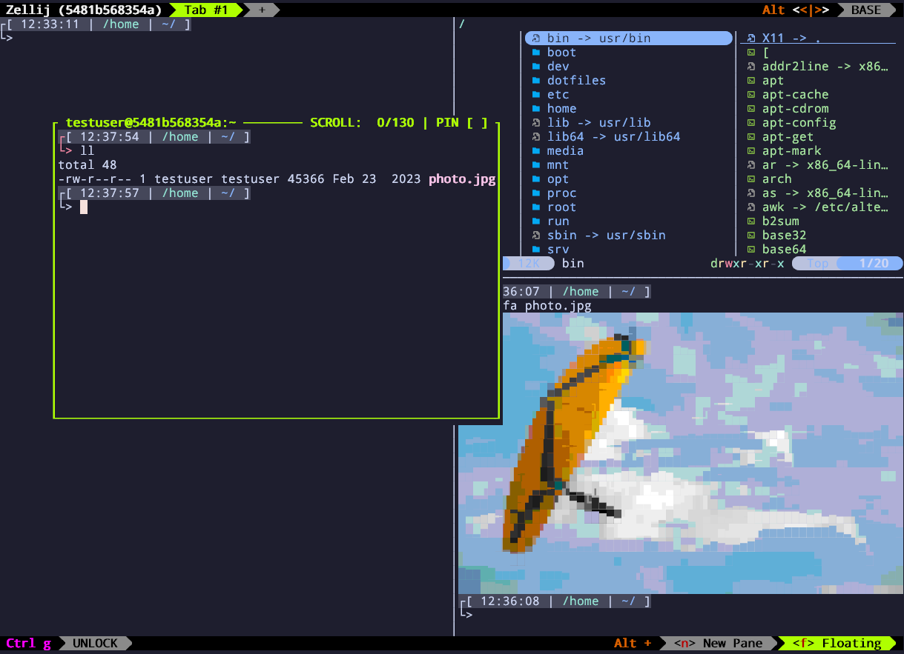

= Dotfiles
:toc:
:toc-placement: preamble

.How it looks like

Personal dotfiles managed with https://www.chezmoi.io/[chezmoi].

chezmoi only tracks the dotfiles themselves. 
All installation (packages, Oh My Zsh, the `jumo` theme, chezmoi itself) lives in a standalone `install.sh` bootstrap script.

== Install

On a fresh machine, install git, clone the repo straight into chezmoi's source directory, and run the installer from there:

[source,shell]
----
sudo apt update && sudo apt install -y git
git clone https://github.com/jujumo/dotfiles.git ~/.local/share/chezmoi
sh ~/.local/share/chezmoi/install.sh
----

This installs the packages and tools listed below, then applies the dotfiles from that clone (including the `jumo` theme). The source repo is the clone's `origin`: to use another repo, clone that one instead.

Installation is best effort: a step that lacks permissions or prerequisites is skipped and the next one runs. Without root or passwordless sudo, the installer asks once whether to use sudo. Two environment variables change this:

* `NO_ROOT=1` — never use sudo (system packages are skipped).
* `UNATTENDED=1` — never prompt (steps that would need a password are skipped).

=== Authorizing SSH login keys

Set `SSH_KEYS_URL` when running step 3 to also authorize SSH keys for logging *into* this machine. The installer fetches the public keys from that URL and appends them to `~/.ssh/authorized_keys` (append-only and idempotent — existing entries are left untouched), and installs `openssh-server` so the host is reachable. Unset by default, so nothing is authorized unless you opt in.

The handiest source is your GitHub account's public keys:

[source,shell]
----
SSH_KEYS_URL=https://github.com/jujumo.keys sh ~/.local/share/chezmoi/install.sh
----

Any URL `curl` can read works (including a local `file://` path). Only *public* keys are ever handled — no private key material is involved.

== What gets installed

The `install.sh` script sets up:

* base packages: `ca-certificates`, `curl`, `git`, `openssh-client`, `zsh`, `nano`
* extra packages: `btop`, `screen`, `micro`, `unzip`, `bzip2`, `build-essential`, `perl`
* *Oh My Zsh* (unattended, without generating its own `.zshrc` — chezmoi owns that), and zsh as the login shell
* *chezmoi*, into `~/.local/bin`
* *openssh-server* — only when `SSH_KEYS_URL` is set (see above)
* *appman*, *zellij*, *yazi* and *GNU parallel*, into `~/.local/bin` (optional)
* a short list of applications installed via `appman` (currently: `gitui`)

System packages need root (apt); everything else installs into your home directory.

Files not meant for `$HOME` (`README.adoc`, `CLAUDE.md`, `install.sh`) are excluded via `.chezmoiignore`.

== Update

`install.sh` is idempotent and is also the update command: re-run it and it pulls the latest commits of the source repo and applies them (steps already done — Oh My Zsh, chezmoi — are skipped). Pull first, so that a change to `install.sh` itself (a new package, for example) is the version that runs:

[source,shell]
----
git -C ~/.local/share/chezmoi pull
sh ~/.local/share/chezmoi/install.sh
----

For the dotfiles only, without going through the package step:

[source,shell]
----
chezmoi update             # git pull + apply
----

NOTE: `chezmoi update` rebases the source directory. If you have local commits there that are not pushed, the pull can stop on a conflict — nothing is applied until you resolve it.

== Day-to-day usage

[source,shell]
----
chezmoi apply              # apply changes to $HOME
chezmoi diff               # preview changes
chezmoi add ~/.someconfig  # track a new file
chezmoi edit ~/.zshrc --apply
----
